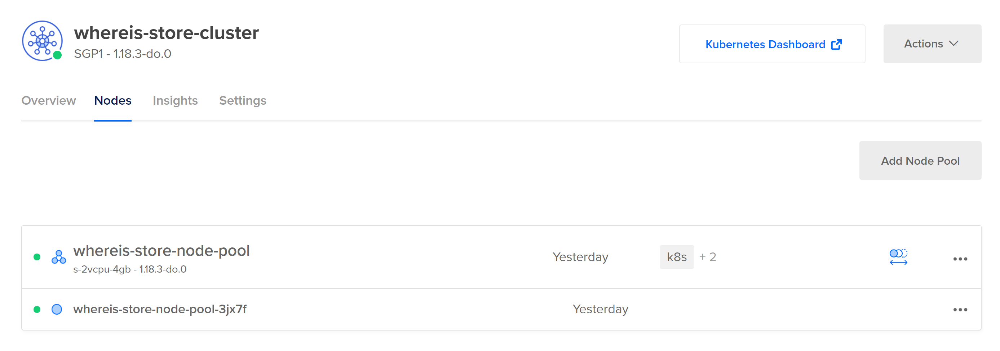
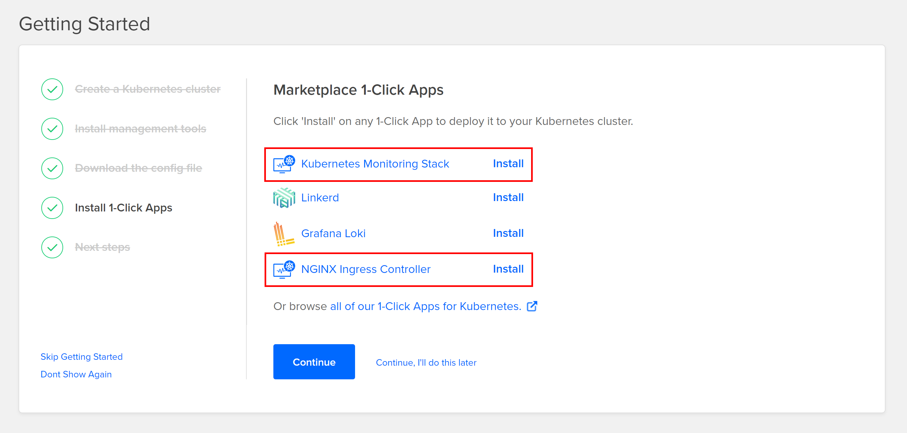

# Kubernetes Demo

> เป็น Demo Kubernetes ง่าย ๆ บน DOKS หรือ DigitalOcean Kubernetes Service



# Google Slide

- [พื้นฐาน Docker โดย Jittagornp.me](https://docs.google.com/presentation/d/1NXArkIDFIJMmcvXY63cc5z7jIsbx8SDZqt76RqeuGwU/edit?usp=sharing)
- [พื้นฐาน Kubernetes โดย jittagornp.me](https://docs.google.com/presentation/d/1Dg8dYMF4kcj6ly2Pi2KeBF1BsWPjWhPrvN9W9tREW5w/edit?usp=sharing)

# Prerequisites

- สร้าง Kubernetes Cluster บน DigitalOcean
- ลง App เพิ่มเติมตอนสร้าง Cluster คือ 
    - NGINX Ingress Controller
    - Kubernetes Monitoring Stack
- มี Docker Registry เรียบร้อยแล้ว สามารถทำเองได้ง่าย ๆ ตามนี้ [การทำ Docker Registry ขึ้นมาใช้งานเอง](https://www.jittagornp.me/blog/install-docker-registry/?series=docker) 
- Build Docker Image ใน Repository นี้ แล้ว Push ไปเก็บที่ Docker Registry แล้ว
- ตอนสร้าง Cluster เสร็จ ให้ Download File Config มาแทนที่ `kubeconfig.yaml` 

อย่าลืม Install 2 อันนี้ 
  


# Show

### Show Nodes

```sh
$ kubectl --kubeconfig="kubeconfig.yaml" get nodes

NAME                            STATUS   ROLES    AGE   VERSION
whereis-store-node-pool-3jx7f   Ready    <none>   30h   v1.18.3
```

### Show Nodes CPU/Memory 

```sh
$ kubectl --kubeconfig="kubeconfig.yaml" top nodes

NAME                            CPU(cores)   CPU%   MEMORY(bytes)   MEMORY%
whereis-store-node-pool-3jx7f   145m         7%     2155Mi          69%
```

ต้อง apply `doks-metrics-server.yaml` ก่อน ไม่งั้นจะเห็นเป็น error แบบบนี้ 

```plaintext
Error from server (NotFound): the server could not find the requested resource (get services http:heapster:)
```
หรือไม่ก็ต้องติดตั้ง `Kubernetes Monitoring Stack` ก่อน 

### Show Pods CPU/Memory 

```sh
$ kubectl --kubeconfig="kubeconfig.yaml" top pods

NAME                                             CPU(cores)   MEMORY(bytes)
whereis-store-api-deployment-9745ffbcb-7gw78     1m           106Mi
whereis-store-app-deployment-5ff74b4449-s6mzs    1m           105Mi
whereis-store-app-deployment-5ff74b4449-sfz8z    1m           118Mi
whereis-store-app-deployment-5ff74b4449-z9d6c    1m           110Mi
whereis-store-image-deployment-94575dcd9-brjx8   1m           106Mi
whereis-store-video-deployment-ffd87c595-v7pd9   1m           113Mi
```

### Show All

```sh
$ kubectl --kubeconfig="kubeconfig.yaml" get all

NAME                                                  READY   STATUS    RESTARTS   AGE
pod/whereis-store-api-deployment-9745ffbcb-xfbxt      1/1     Running   0          31m
pod/whereis-store-app-deployment-849bcbd9f6-mxc55     1/1     Running   0          74m
pod/whereis-store-image-deployment-55cbd94598-kh7fs   1/1     Running   0          56m
pod/whereis-store-video-deployment-c55444f96-vq4b4    1/1     Running   0          52m

NAME                                  TYPE        CLUSTER-IP       EXTERNAL-IP   PORT(S)   AGE
service/kubernetes                    ClusterIP   10.245.0.1       <none>        443/TCP   89m
service/whereis-store-api-service     ClusterIP   10.245.112.203   <none>        80/TCP    62m
service/whereis-store-app-service     ClusterIP   10.245.190.244   <none>        80/TCP    65m
service/whereis-store-image-service   ClusterIP   10.245.233.118   <none>        80/TCP    54m
service/whereis-store-video-service   ClusterIP   10.245.96.84     <none>        80/TCP    51m

NAME                                             READY   UP-TO-DATE   AVAILABLE   AGE
deployment.apps/whereis-store-api-deployment     1/1     1            1           63m
deployment.apps/whereis-store-app-deployment     1/1     1            1           74m
deployment.apps/whereis-store-image-deployment   1/1     1            1           56m
deployment.apps/whereis-store-video-deployment   1/1     1            1           52m

NAME                                                        DESIRED   CURRENT   READY   AGE
replicaset.apps/whereis-store-api-deployment-5d9ddc4b9      0         0         0       63m
replicaset.apps/whereis-store-api-deployment-9745ffbcb      1         1         1       31m
replicaset.apps/whereis-store-app-deployment-849bcbd9f6     1         1         1       74m
replicaset.apps/whereis-store-image-deployment-55cbd94598   1         1         1       56m
replicaset.apps/whereis-store-video-deployment-c55444f96    1         1         1       52m

NAME                                                        REFERENCE                                 TARGETS   MINPODS   MAXPODS
 REPLICAS   AGE
horizontalpodautoscaler.autoscaling/whereis-store-api-hpa   Deployment/whereis-store-api-deployment   1%/80%    1         10
 1          40m
```

### Show Secrets

```sh
$ kubectl --kubeconfig="kubeconfig.yaml" get secrets

NAME                     TYPE                                  DATA   AGE
default-token-zlczm      kubernetes.io/service-account-token   3      30h
registry-whereis-store   kubernetes.io/dockerconfigjson        1      29h
```

### Show Services

```sh
$ kubectl --kubeconfig="kubeconfig.yaml" get services

NAME                          TYPE        CLUSTER-IP       EXTERNAL-IP   PORT(S)   AGE
kubernetes                    ClusterIP   10.245.0.1       <none>        443/TCP   30h
whereis-store-api-service     ClusterIP   10.245.202.30    <none>        80/TCP    28h
whereis-store-app-service     ClusterIP   10.245.28.113    <none>        80/TCP    28h
whereis-store-image-service   ClusterIP   10.245.131.223   <none>        80/TCP    28h
whereis-store-video-service   ClusterIP   10.245.246.202   <none>        80/TCP    28h
```

### Show Pods

```sh
$ kubectl --kubeconfig="kubeconfig.yaml" get pods

NAME                                             READY   STATUS    RESTARTS   AGE
whereis-store-api-deployment-9745ffbcb-7gw78     1/1     Running   0          28h
whereis-store-app-deployment-5ff74b4449-s6mzs    1/1     Running   0          28h
whereis-store-app-deployment-5ff74b4449-sfz8z    1/1     Running   0          28h
whereis-store-app-deployment-5ff74b4449-z9d6c    1/1     Running   0          28h
whereis-store-image-deployment-94575dcd9-brjx8   1/1     Running   0          28h
whereis-store-video-deployment-ffd87c595-v7pd9   1/1     Running   0          28h
```

Show all
```sh
$ kubectl --kubeconfig="kubeconfig.yaml" get pods -A

NAMESPACE       NAME                                                      READY   STATUS    RESTARTS   AGE
default         whereis-store-deployment-6b99d96866-cbg8w                 1/1     Running   0          16m
ingress-nginx   nginx-ingress-ingress-nginx-controller-7995b44bfd-d6gl2   1/1     Running   0          5m4s
kube-system     cilium-9l57f                                              1/1     Running   0          18m
kube-system     cilium-operator-7c59b5d8d-cqw2t                           1/1     Running   0          20m
kube-system     coredns-6b6854dcbf-tjdzs                                  1/1     Running   0          20m
kube-system     coredns-6b6854dcbf-xck2l                                  1/1     Running   0          20m
kube-system     csi-do-node-hqvfm                                         2/2     Running   0          18m
kube-system     do-node-agent-nm8sb                                       1/1     Running   0          18m
kube-system     kube-proxy-5fbq9                                          1/1     Running   0          18m
kube-system     metrics-server-57f5b96ff5-8f8x7                           1/1     Running   0          9m13s
```

### Show Deployment

```sh
$ kubectl --kubeconfig="kubeconfig.yaml" get deployments

NAME                             READY   UP-TO-DATE   AVAILABLE   AGE
whereis-store-api-deployment     1/1     1            1           28h
whereis-store-app-deployment     3/3     3            3           28h
whereis-store-image-deployment   1/1     1            1           28h
whereis-store-video-deployment   1/1     1            1           28h
```

### Show Namespace
```sh
$ kubectl --kubeconfig="kubeconfig.yaml" get namespaces

NAME                  STATUS   AGE
default               Active   30h
ingress-nginx         Active   29h
kube-node-lease       Active   30h
kube-public           Active   30h
kube-system           Active   30h
prometheus-operator   Active   29h
```

### Show HorizontalPodAutoScaler

```sh
$ kubectl --kubeconfig="kubeconfig.yaml" get hpa

NAME                    REFERENCE                                 TARGETS         MINPODS   MAXPODS   REPLICAS   AGE
whereis-store-app-hpa   Deployment/whereis-store-app-deployment   <unknown>/80%   1         100       0          2s
```

# Create 

### Create Secret

```sh
$ kubectl --kubeconfig="kubeconfig.yaml" create secret docker-registry registry-whereis-store --docker-server=https://registry.whereis.store --docker-username=test --docker-password=QbBGKgJynzqKDUs8ZXv --docker-email=<YOUR_EMAIL>
```

# Apply

### Apply Deployment

```sh
$ kubectl --kubeconfig="kubeconfig.yaml" apply -f App-Deployment.yml
```

### Apply Service

```sh
$ kubectl --kubeconfig="kubeconfig.yaml" apply -f App-Service-ClusterIP.yml
```

# Ingress

### Apply Ingress
```sh
$ kubectl --kubeconfig="kubeconfig.yaml" apply -f Ingress.yml
```

### Show Ingress

```sh
$ kubectl --kubeconfig="kubeconfig.yaml" get ingress

NAME                    CLASS    HOSTS           ADDRESS         PORTS   AGE
whereis-store-ingress   <none>   whereis.store   167.99.xx.xx   80      3h30m
```

### Delete Ingress

```sh
$ kubectl --kubeconfig="kubeconfig.yaml" delete ingress whereis-store-ingress
```

# Manual Scale Pods (Replicas)

```sh
$ kubectl --kubeconfig="kubeconfig.yaml" scale deployment.apps/whereis-store-api-deployment --replicas 3
```

# DO Command Line Tool

### Login 
```sh
$ doctl auth init
```

# Auto Scale Nodes

```sh
$ doctl kubernetes cluster node-pool update whereis-store-cluster whereis-store-node-pool --auto-scale --min-nodes 3 --max-nodes 10
```

# Load Test 

### Wrk
```sh
$ docker run --rm skandyla/wrk -t 1 -c 1000 -d 3m http://167.99.xx.xx
```
